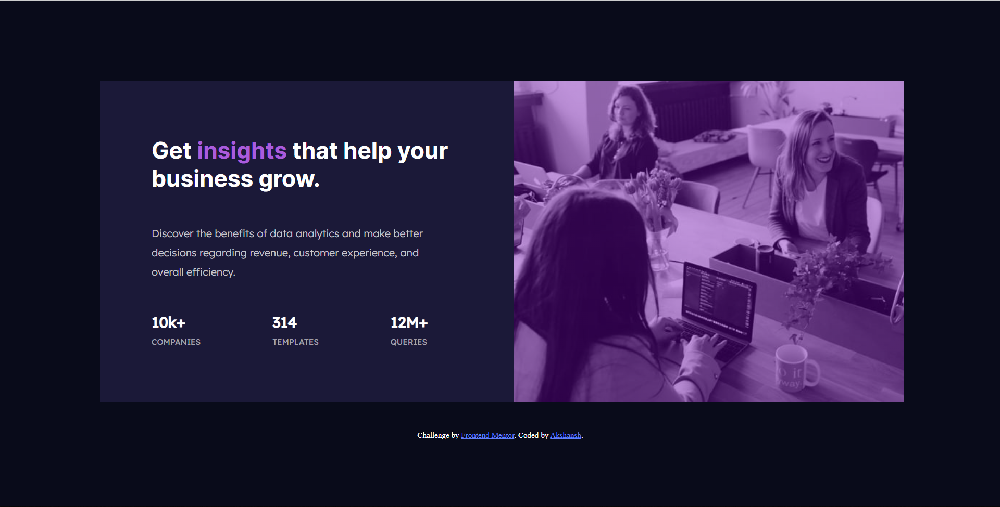

# Frontend Mentor - Stats preview card component solution

This is a solution to the [Stats preview card component challenge on Frontend Mentor]

## Table of contents

- [Overview](#overview)
  - [The challenge](#the-challenge)
  - [Screenshot](#screenshot)
  - [Links](#links)
- [My process](#my-process)
  - [Built with](#built-with)
  - [What I learned](#what-i-learned)

## Overview

### The challenge

Users should be able to:

- View the optimal layout depending on their device's screen size

### Screenshot

### Links

- Solution URL: https://www.frontendmentor.io/solutions/stats-preview-card-component-sTkihAR7zQ
- Live Site URL: https://akshansh029.github.io/FEM-stats-preview-card/

## My process

I started by dividing elements in different divs and then started with writing HTML and assigning different class names to relative divs. I used top to bottom approach in writing CSS.

### Built with

- Semantic HTML5 markup
- CSS custom properties
- Flexbox
- CSS Grid

### What I learned

I learned how to use media queries for different screen sizes, I wrote media queries for 3 different sizes 1440px, 768px and 680px. I found difficulty in writing media queries and i'd like to learn more about it.
